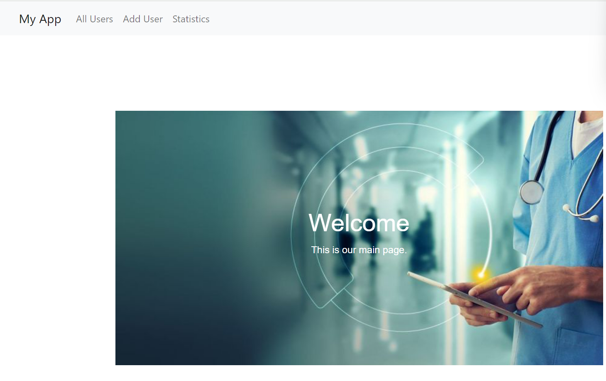
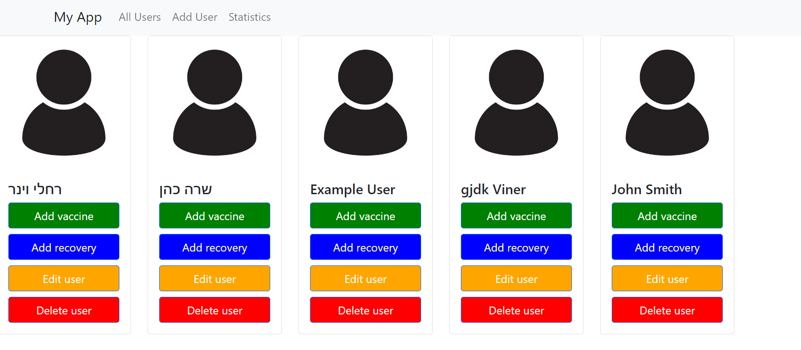
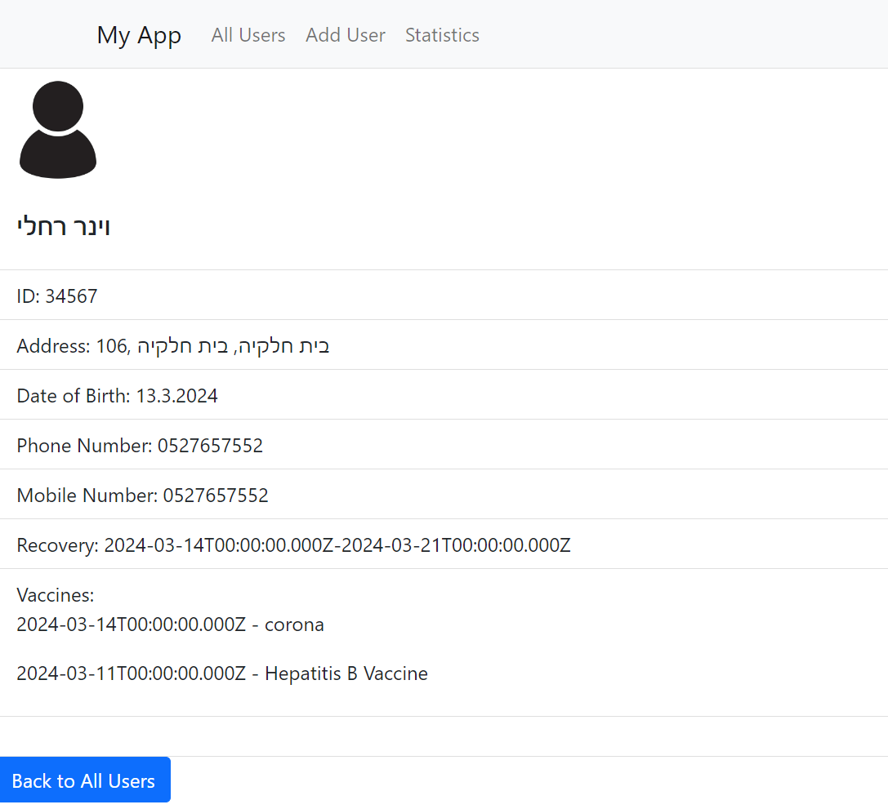
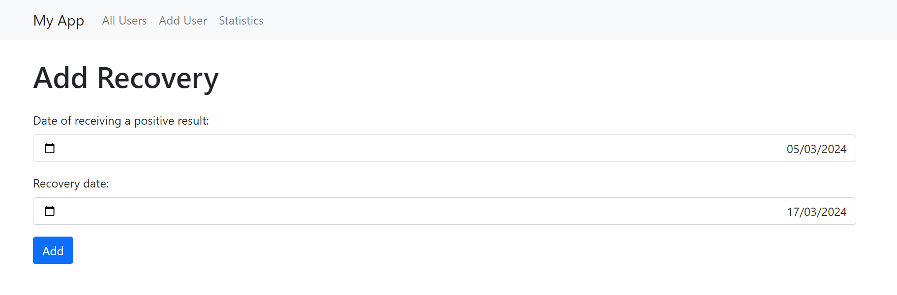
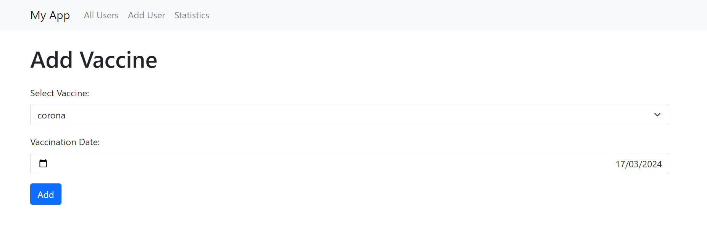
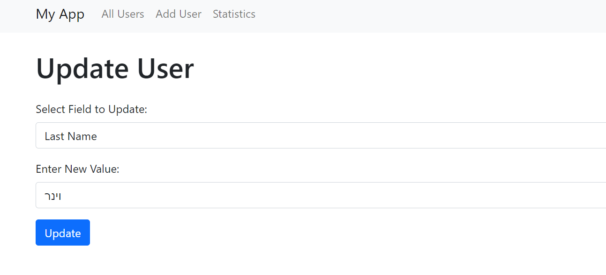
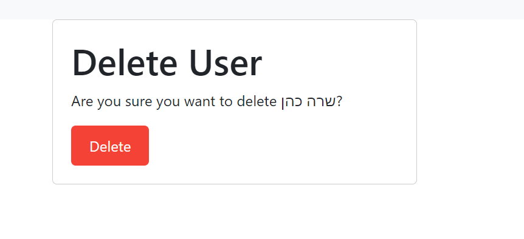
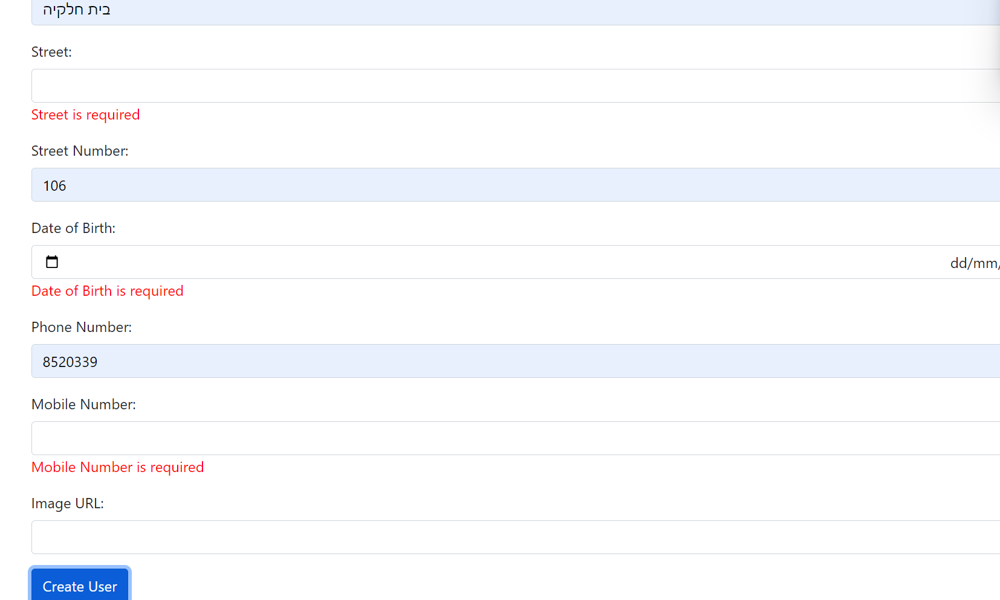

# מערכת לניהול מחלקת קורונה בקופות חולים🦠💉
## מטרת המערכת ##

מערכת זו פותחה במטרה לסייע לקופות חולים בניהול יעיל ומקצועי של בריכות חולי קורונה, תוך שמירה על דיוק נתונים וזמינות מידע. המערכת תורמת לקבלת החלטות מושכלות בנוגע להתמודדות עם המגיפה, תוך שמירה על בריאות חברי קופת החולים.

## תיאור המערכת ##

מערכת זו פותחה במטרה לייעל את ניהול תחום חולי קורונה בקופות חולים גדולות. המערכת מאפשרת:

### ניהול חברי קופת החולים -
💉הצגת רשימה מלאה של חברי קופת החולים.
💉הוספת חברים חדשים למערכת.
💉עריכת פרטי חברים קיימים.
💉מחיקת חברים שאינם רלוונטיים עוד.
### ניהול נתוני קורונה-
💉רישום תאריכי חיסון של חברי קופת החולים.
💉מעקב אחר תאריכי הדבקה בקורונה (במידה וקיימים).
💉תיעוד תאריכי החלמה.
### שליפת נתונים-
💉ביצוע שאילתות במאגר המידע לפרטי חברים ספציפיים.
💉הפקת דו"חות סטטיסטיים בנוגע למגיפת הקורונה בקרב חברי קופת החולים.
## יתרונות המערכת ##

### יעילות 
המערכת מאפשרת ניהול מרוכז ויעיל של כל המידע הרלוונטי לחברי קופת החולים בהקשר של מגפת הקורונה.
### דיוק 
רישום נתונים מדויק ומעודכן תורם לקבלת החלטות מושכלות בנוגע להתמודדות עם המגיפה.
### זמינות 
גישה נוחה וקלה למידע מכל מקום ובכל זמן.
### ניתוח נתונים 
הפקת דו"חות סטטיסטיים מאפשרת קבלת תובנות חשובות בנוגע להתפשטות המגיפה בקרב חברי קופת החולים.
## אופן השימוש 

### צד הלקוח 
המערכת זמינה דרך דפדפן אינטרנט, ומאפשרת למשתמשים להציג ולערוך נתונים, וכן לבצע שאילתות.
### צד השרת ##
צד השרת מספק ממשקי API לתקשורת עם צד הלקוח, ומאפשר ביצוע פעולות CRUD (יצירה, קריאה, עדכון, מחיקה) ושאילתות מסד נתונים.
## התקנה ותפעול ##

### התקנה ##
יש לשכפל את המאגר ולהתקין תלות באמצעות npm install.
### הפעלה ##
הפעל את השרת באמצעות npm start וגישה לצד הלקוח דרך דפדפן אינטרנט.
## תצוגה סכמטית של מאגר המידע

#### Patients Collection:
| Field        | Type          | Mandatory | Description       |
|--------------|---------------|-----------|-------------------|
| patientId    | String        | Yes       | Unique identifier for the patient. |
| firstName    | String        | Yes       | First name of the patient. |
| lastName     | String        | Yes       | Last name of the patient. |
| address      | Object        | Yes       | Patient's address (contains city, street, and number). |
| dateOfBirth  | Date          | Yes       | Date of birth of the patient. |
| phoneNumber  | String        | Yes       | Phone number of the patient. |
| mobileNumber | String        | Yes       | Mobile number of the patient. |

#### Recoveries Collection:
| Field        | Type          | Mandatory | Description       |
|--------------|---------------|-----------|-------------------|
| patientId    | ObjectId      | Yes       | Foreign key referencing the patient in Patients collection. |
| positiveDate | Date          | Yes       | Date when the patient tested positive. |
| recoveryDate | Date          | Yes       | Date when the patient recovered. |

#### Vaccinators Collection:
| Field        | Type          | Mandatory | Description       |
|--------------|---------------|-----------|-------------------|
| patientId    | ObjectId      | Yes       | Foreign key referencing the patient in Patients collection. |
| vaccineId    | ObjectId      | Yes       | Foreign key referencing the vaccine in Vaccines collection. |
| vaccineDate  | Date          | Yes       | Date when the vaccination was administered. |

#### Vaccines Collection:
| Field        | Type          | Mandatory | Description       |
|--------------|---------------|-----------|-------------------|
| vaccineId    | String        | Yes       | Unique identifier for the vaccine. |
| vaccineName  | String        | Yes       | Name of the vaccine. |

דף כניסה:

דף שמראה את כל משתמשי המערכת:

כשלוחצים על אחד מהמשתמשים הוא מראה את כל הפרטים שלו:

הוספת מחלים מקורונה:

הוספת מחוסן קורונה:

עריכת פציינט:

מחיקת פציינט:

הוספת פציינט חדש:

